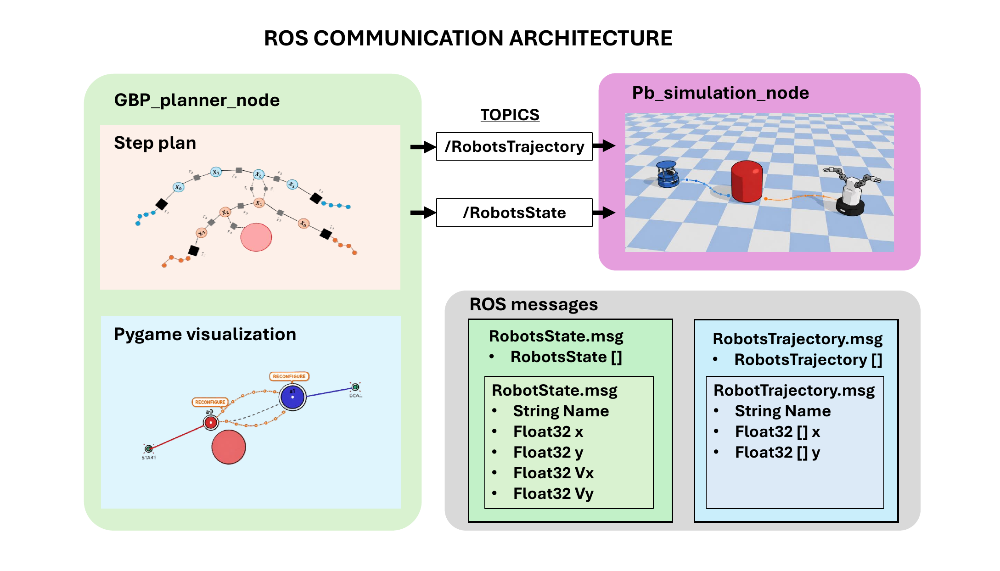
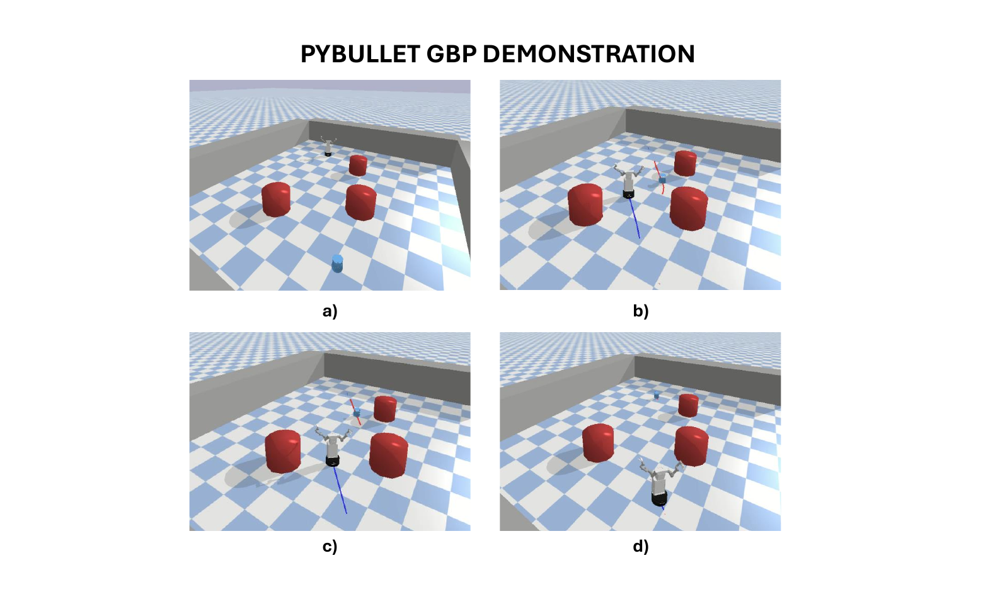

# Multi-Robot Navigation using Gaussian Belief Propagation - ROS/PyBullet Version

ROS Noetic and PyBullet implementation of a multi-robot navigation framework based on **Gaussian Belief Propagation (GBP)**.

This branch contains the ROS integration of the GBP planner. The planner can be executed either with the original Pygame visualisation or with a PyBullet-based 3D visualisation.

---

## System

Tested on:

- Ubuntu 20.04.6 LTS
- ROS Noetic 1.17
- Python 3
- PyBullet

---

## Overview

The system is divided into two main ROS nodes:

- `gbp_planner_node`: loads the environment, creates the agents, runs the GBP planner and publishes robot states and planned trajectories.
- `pb_simulation_node`: loads the PyBullet world, subscribes to the planner topics and visualises the robots, obstacles and GBP trajectories in 3D.

When using Pygame mode, only the planner node is required. When using PyBullet mode, both the planner node and the PyBullet simulation node are launched.



---

## ROS Communication Architecture

The planner publishes two main topics:

```text
/robots_state
/robots_trajectories
```

The `/robots_state` topic contains the current state of each robot, while `/robots_trajectories` contains the predicted GBP horizon for each agent.

The PyBullet node subscribes to these topics and updates both the robot poses and the visual representation of the planned trajectories.

---

## ROS Messages

### RobotState.msg

```text
string name
float32 x
float32 y
float32 vx
float32 vy
```

### RobotsState.msg

```text
RobotState[] robots
```

### RobotTrajectory.msg

```text
string name
float32[] x
float32[] y
```

### RobotsTrajectory.msg

```text
RobotTrajectory[] robots
```

---

## PyBullet Demonstration

The PyBullet visualisation allows the GBP planner to be displayed in a 3D environment with robot URDF models, static obstacles and planned trajectory horizons.



---

## Repository Structure

```text
src/                ROS packages and source code
rosrun/             Launch or execution scripts
doc/                Documentation and README figures
build/              Catkin build folder, ignored by git
devel/              Catkin development folder, ignored by git
```

---

## Building the Workspace

From the workspace root:

```bash
cd ~/GBP_Multi-Robot_System_ROS
catkin_make
source devel/setup.bash
```

If the workspace is already built, only source it:

```bash
source devel/setup.bash
```

---

## Running with Pygame Visualisation

In Pygame mode, only the GBP planner node is required.

Example:

```bash
roslaunch gbp_system gbp_planner.launch env:=config/env1/env1_01.yaml sim:=pg
```

Or directly with `rosrun`:

```bash
rosrun gbp_system gbp_planner_node.py _env_yaml:=/path/to/environment.yaml _sim:=pg
```

In this mode, the planner uses the internal Pygame visualisation and the PyBullet node is not launched.

---

## Running with PyBullet Visualisation

In PyBullet mode, the PyBullet simulation node must be launched together with the GBP planner node.

Example using `roslaunch`:

```bash
roslaunch gbp_system gbp_planner.launch env:=config/env1/env1_01.yaml sim:=pb
```

This mode launches:

```text
gbp_planner_node
pb_simulation_node
```

The planner publishes robot states and predicted trajectories, and the PyBullet node visualises the robots and GBP horizons.

Direct execution with `rosrun` can also be done in two terminals.

Terminal 1:

```bash
rosrun gbp_system pb_sim_node.py _env_yaml:=/path/to/environment.yaml _gui:=true
```

Terminal 2:

```bash
rosrun gbp_system gbp_planner_node.py _env_yaml:=/path/to/environment.yaml _sim:=pb
```

---

## Branches

- `pygame-core`: standalone Python/Pygame implementation.
- `ros-pybullet`: ROS Noetic and PyBullet implementation.