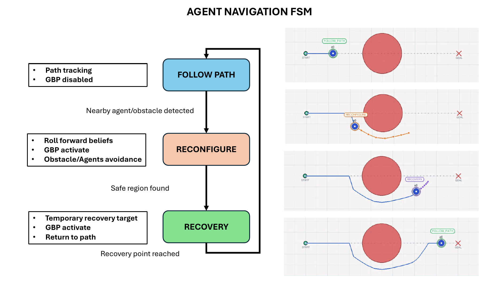
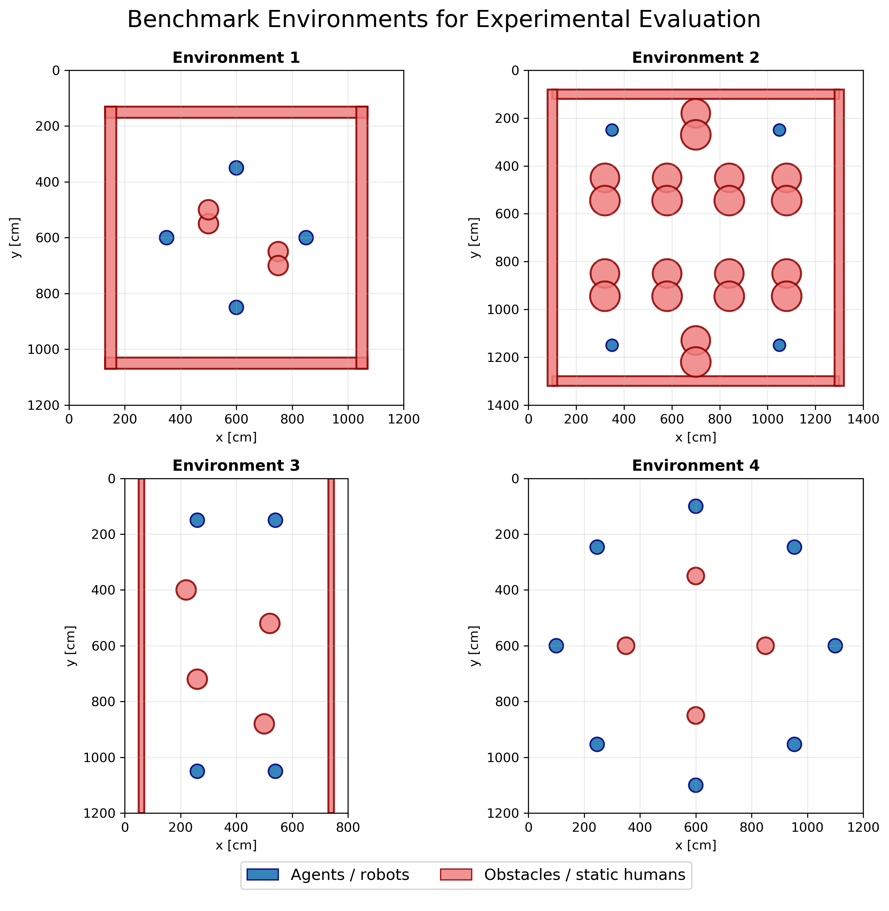
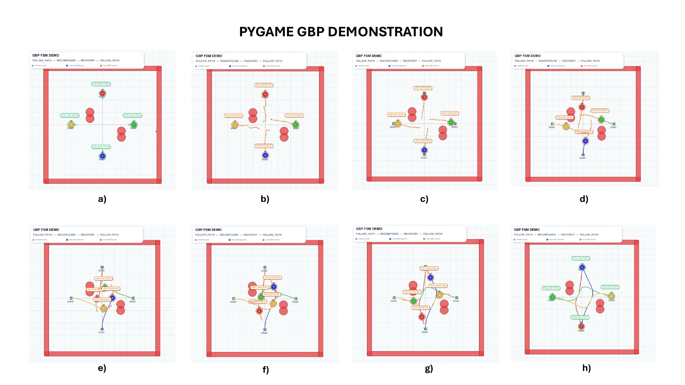

# Multi-Robot Navigation using Gaussian Belief Propagation

Standalone Python/Pygame implementation of a multi-robot navigation framework based on **Gaussian Belief Propagation (GBP)**.

This branch contains the core implementation used for algorithm development, testing, benchmark execution, metric generation and comparison against alternative local planners such as **ORCA+** and **Predictive DWA**.

---

## Overview

The system uses a local factor graph representation to plan future robot states. Each agent switches between path following, GBP-based reconfiguration and recovery behaviour using a finite state machine.



---

## Benchmark Environments

The benchmark includes several multi-robot navigation scenarios with static obstacles and different interaction patterns between agents.



---

## Pygame Demonstration

The standalone implementation includes a Pygame visualisation of the GBP planner, showing path following, reconfiguration and recovery stages.



---

## Features

- Multi-agent navigation in 2D environments.
- Gaussian Belief Propagation planner.
- Finite State Machine for path following, reconfiguration and recovery.
- Static obstacle avoidance.
- Inter-agent collision avoidance.
- Pygame-based visualisation.
- YAML benchmark environments.
- Trajectory logging.
- Metric generation and plotting tools.
- Comparison against ORCA+ and Predictive DWA.

---

## Requirements

Tested on:

- Ubuntu 20.04.6 LTS
- Python 3

Main Python dependencies:

```bash
pip install numpy pygame matplotlib pandas pyyaml
```

---

## Running the Planners

All planners are launched from the repository root using one YAML environment file.

### Run GBP

```bash
python test_planners/test_gbp.py config/env1/env1_01.yaml
```

### Run ORCA+

```bash
python test_planners/test_orca_plus.py config/env1/env1_01.yaml
```

### Run Predictive DWA

```bash
python test_planners/test_pred_dwa.py config/env1/env1_01.yaml
```

### Example using another environment

```bash
python test_planners/test_gbp.py config/env3/env3_01.yaml
python test_planners/test_orca_plus.py config/env3/env3_01.yaml
python test_planners/test_pred_dwa.py config/env3/env3_01.yaml
```

---

## Running a Full Comparison

To compare the three methods, run the same environment with each planner and then generate the metrics and plots using the scripts in `metrics/`.

Example:

```bash
python test_planners/test_gbp.py config/env1/env1_01.yaml
python test_planners/test_orca_plus.py config/env1/env1_01.yaml
python test_planners/test_pred_dwa.py config/env1/env1_01.yaml
```

Then process the generated trajectories with the metric scripts.

Example for generating a LaTeX table:

```bash
python metrics/generate_latex_table.py \
  --summary results/analysis/env1_summary.csv \
  --output results/tables/env1_results.tex \
  --env_name env1
```

---

## Metrics and Plots

The `metrics/` folder contains scripts to generate trajectory metrics, comparison tables, boxplots and environment visualisations.

Example for plotting environment configurations:

```bash
python metrics/plot_environments.py \
  --envs \
    config/env1/env1_01.yaml \
    config/env1/env1_02.yaml \
    config/env1/env1_03.yaml \
    config/env1/env1_04.yaml \
    config/env1/env1_05.yaml \
    config/env1/env1_06.yaml \
    config/env1/env1_07.yaml \
    config/env1/env1_08.yaml \
    config/env1/env1_09.yaml \
    config/env1/env1_10.yaml \
  --cols 5 \
  --title "Environment 1 Test Configurations" \
  --title_mode config \
  --output results/plots/env1_configurations.png
```

---

## Repository Structure

```text
config/             YAML environment configurations
fg/                 Factor graph and Gaussian belief propagation core
motion/             Agent FSM, obstacle map and GBP factor nodes
metrics/            Metric generation and plotting scripts
test_planners/      Execution scripts for GBP, ORCA+ and Predictive DWA
results/            Generated outputs, ignored by git
```

---

## Branches

- `pygame-core`: standalone Python/Pygame implementation.
- `ros-pybullet`: ROS Noetic and PyBullet implementation.